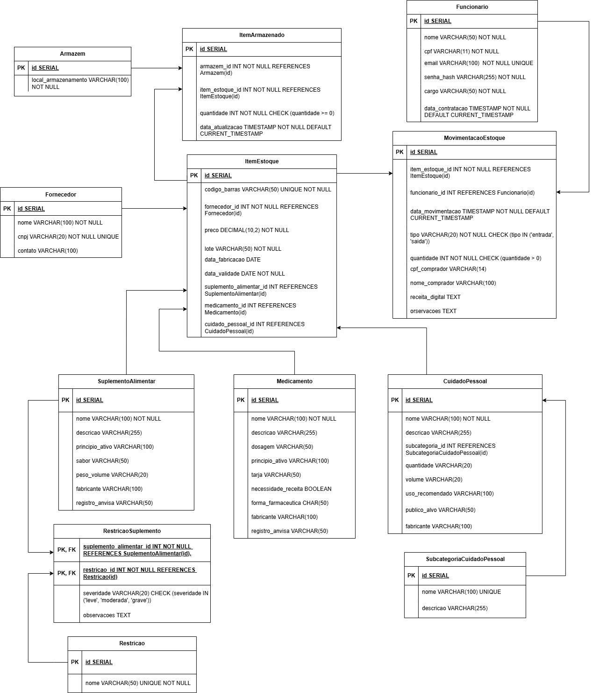

# Especificação do Banco de Dados

O banco de dados foi desenvolvido para gerenciar um sistema de estoque de produtos farmacêuticos e cosméticos, incluindo suplementos alimentares, medicamentos e cosméticos. Ele contempla controle de fornecedores, armazenamento, movimentação de estoque e vendas.

---

## Diagrama Entidade-Relacionamento (DER)

---

## Dicionário de Dados

---

### **ProdutoBase**
| Campo            | Tipo         | PK | FK | Nullable | Descrição                                      |
|------------------|--------------|----|----|----------|-------------------------------------------------|
| produto_base_id  | SERIAL       | ✔️ |    | ❌       | Identificador único do produto base             |
| nome             | CHAR(100)    |    |    | ❌       | Nome do produto                                 |
| descricao        | CHAR(255)    |    |    | ✔️       | Descrição opcional do produto                   |

---

### **SuplementoAlimentar**
| Campo            | Tipo         | PK | FK | Nullable | Descrição                                      |
|------------------|--------------|----|----|----------|-------------------------------------------------|
| produto_base_id  | INT          | ✔️ | ✔️ | ❌       | Ref. ProdutoBase(produto_base_id)               |
| peso_volume      | CHAR(20)     |    |    | ✔️       | Peso ou volume do suplemento                    |
| sabor            | CHAR(50)     |    |    | ✔️       | Sabor                                           |
| restricoes       | TEXT         |    |    | ✔️       | Restrições alimentares gerais                   |

---

### **Medicamento**
| Campo                | Tipo         | PK | FK | Nullable | Descrição                                      |
|----------------------|--------------|----|----|----------|-------------------------------------------------|
| produto_base_id      | INT          | ✔️ | ✔️ | ❌       | Ref. ProdutoBase(produto_base_id)               |
| tarja                | CHAR(20)     |    |    | ✔️       | Cor da tarja                                    |
| necessita_receita    | BOOLEAN      |    |    | ✔️       | Indica se necessita receita                     |
| dosagem              | CHAR(50)     |    |    | ✔️       | Dosagem                                         |
| principio_ativo      | CHAR(100)    |    |    | ✔️       | Princípio ativo                                 |
| forma_farmaceutica   | CHAR(50)     |    |    | ✔️       | Forma farmacêutica                              |
| via_administracao    | CHAR(50)     |    |    | ✔️       | Via de administração                            |

---

### **Cosmetico**
| Campo            | Tipo         | PK | FK | Nullable | Descrição                                      |
|------------------|--------------|----|----|----------|-------------------------------------------------|
| produto_base_id  | INT          | ✔️ | ✔️ | ❌       | Ref. ProdutoBase(produto_base_id)               |
| tipo_produto     | CHAR(50)     |    |    | ✔️       | Tipo do produto                                 |
| volume           | CHAR(20)     |    |    | ✔️       | Volume                                          |
| faixa_etaria     | CHAR(20)     |    |    | ✔️       | Faixa etária recomendada                        |

---

### **Restricao**
| Campo            | Tipo         | PK | FK | Nullable | Descrição                                      |
|------------------|--------------|----|----|----------|-------------------------------------------------|
| restricao_id     | SERIAL       | ✔️ |    | ❌       | ID único da restrição                           |
| nome_restricao             | CHAR(50)     |    |    | ❌       | Nome da restrição (Ex.: lactose, glúten)       |

---

### **RestricaoSuplemento**
| Campo            | Tipo         | PK | FK | Nullable | Descrição                                      |
|------------------|--------------|----|----|----------|-------------------------------------------------|
| produto_base_id  | INT          | ✔️ | ✔️ | ❌       | Ref. SuplementoAlimentar(produto_base_id)      |
| restricao_id     | INT          | ✔️ | ✔️ | ❌       | Ref. Restricao(restricao_id)                   |

---

### **Fornecedor**
| Campo            | Tipo         | PK | FK | Nullable | Descrição                                      |
|------------------|--------------|----|----|----------|-------------------------------------------------|
| fornecedor_id    | SERIAL       | ✔️ |    | ❌       | ID do fornecedor                               |
| nome             | CHAR(100)    |    |    | ❌       | Nome do fornecedor                             |
| cnpj             | CHAR(20)     |    |    | ❌       | CNPJ                                           |
| contato          | CHAR(100)    |    |    | ✔️       | Contato (telefone, email, etc)                 |

---

### **ItemEstoque**
| Campo            | Tipo         | PK | FK | Nullable | Descrição                                      |
|------------------|--------------|----|----|----------|-------------------------------------------------|
| item_estoque_id  | SERIAL       | ✔️ |    | ❌       | ID do item no estoque                          |
| codigo_barras    | CHAR(50)     |    |    | ❌       | Código de barras (único)                       |
| fornecedor_id    | INT          |    | ✔️ | ❌       | Ref. Fornecedor(fornecedor_id)                 |
| produto_base_id  | INT          |    | ✔️ | ❌       | Ref. ProdutoBase(produto_base_id)              |
| preco            | FLOAT        |    |    | ✔️       | Preço                                          |
| validade         | DATE         |    |    | ✔️       | Data de validade                               |

---

### **ItemArmazenado**
| Campo             | Tipo         | PK | FK | Nullable | Descrição                                      |
|-------------------|--------------|----|----|----------|-------------------------------------------------|
| item_armazenado_id| SERIAL       | ✔️ |    | ❌       | ID do item armazenado                          |
| armazem_id        | INT          |    | ✔️ | ❌       | Ref. Armazem(armazem_id)                       |
| item_estoque_id   | INT          |    | ✔️ | ❌       | Ref. ItemEstoque(item_estoque_id)              |
| quantidade        | INT          |    |    | ❌       | Quantidade em estoque                          |

---

### **Armazem**
| Campo            | Tipo         | PK | FK | Nullable | Descrição                                      |
|------------------|--------------|----|----|----------|-------------------------------------------------|
| armazem_id       | SERIAL       | ✔️ |    | ❌       | ID do armazém                                  |
| local_armazenamento | CHAR(100) |    |    | ❌       | Localização do armazém                         |

---

### **MovimentoEstoque**
| Campo                  | Tipo         | PK | FK | Nullable | Descrição                                      |
|------------------------|--------------|----|----|----------|-------------------------------------------------|
| movimentacao_estoque_id| SERIAL       | ✔️ |    | ❌       | ID da movimentação                             |
| item_estoque_id        | INT          |    | ✔️ | ❌       | Ref. ItemEstoque(item_estoque_id)              |
| data                   | TIMESTAMP    |    |    | ❌       | Data da movimentação                           |
| tipo                   | CHAR(20)     |    |    | ❌       | Tipo ('entrada' ou 'saida')                    |
| quantidade             | INT          |    |    | ❌       | Quantidade movimentada                         |

---

### **Venda**
| Campo            | Tipo         | PK | FK | Nullable | Descrição                                      |
|------------------|--------------|----|----|----------|-------------------------------------------------|
| venda_id         | SERIAL       | ✔️ |    | ❌       | ID da venda                                    |
| data_venda       | TIMESTAMP    |    |    | ❌       | Data da venda                                  |
| valor_total      | FLOAT        |    |    | ❌       | Valor total da venda                           |

---

### **ItemVenda**
| Campo             | Tipo         | PK | FK | Nullable | Descrição                                      |
|-------------------|--------------|----|----|----------|-------------------------------------------------|
| item_venda_id     | SERIAL       | ✔️ |    | ❌       | ID do item da venda                            |
| venda_id          | INT          |    | ✔️ | ❌       | Ref. Venda(venda_id)                           |
| item_estoque_id   | INT          |    | ✔️ | ❌       | Ref. ItemEstoque(item_estoque_id)              |
| quantidade        | INT          |    |    | ❌       | Quantidade vendida                             |
| preco_unitario    | FLOAT        |    |    | ❌       | Preço unitário na venda                        |

---

## 5. Regras de Integridade
- Todas as chaves primárias são únicas e não nulas.
- Foreign Keys garantem integridade referencial entre as tabelas.
- Campos como `codigo_barras` e `nome_restricao` possuem restrições de unicidade.
- Movimentações possuem domínio restrito para o campo `tipo` ('entrada' ou 'saida').

---
