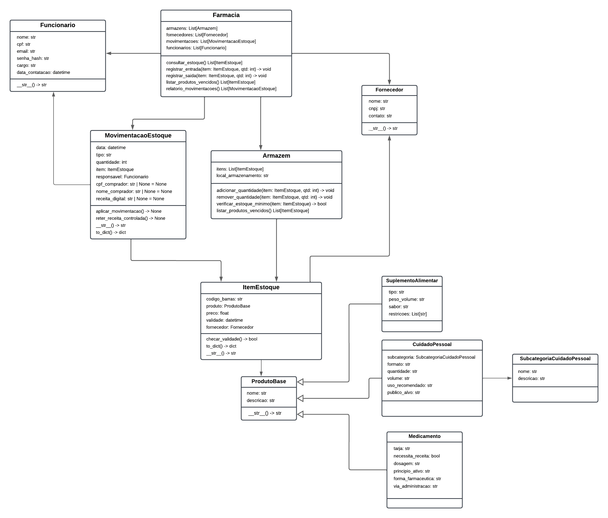

# Visão Geral - ReMed.io

**ReMed.io** é um sistema de gerenciamento de estoque para farmácias, desenvolvido com o objetivo de digitalizar e automatizar os processos de controle de produtos, vendas e movimentações de estoque. Seu principal objetivo é fornecer uma plataforma eficiente para o gerenciamento de medicamentos, cosméticos e suplementos, garantindo rastreabilidade, segurança e precisão nas operações de entrada, saída e comercialização de itens farmacêuticos.

---

## Tecnologias Utilizadas
 
 

<table style="font-size: 16px; text-align: center; border-collapse: collapse;">
    <tr>
      <th>Camada</th>
      <th>Ferramentas / Tecnologias</th>
    </tr>
  </thead>
  <tbody>
    <tr>
      <td><strong>Frontend</strong></td>
      <td>React, TypeScript, TailwindCSS</td>
    </tr>
    <tr>
      <td><strong>Backend</strong></td>
      <td>FastAPI, Python 3.11</td>
    </tr>
    <tr>
      <td><strong>Banco de Dados</strong></td>
      <td>PostgreSQL, DBeaver</td>
    </tr>
    <tr>
      <td><strong>DevOps</strong></td>
      <td>Docker, Docker Compose</td>
    </tr>
    <tr>
      <td><strong>Outras libs</strong></td>
      <td>Pydantic, SQLAlchemy, Pyenv</td>
    </tr>
  </tbody>
</table>

---

## Arquitetura do sistema

O projeto adota uma arquitetura **modular** baseada em repositórios independentes, organizados de forma a promover separação de responsabilidades e facilidade de manutenção. A aplicação é composta por três principais repositórios:

- [`Backend-estoque`](https://github.com/seu-usuario/remed.io-backend): API RESTful desenvolvida em Python com FastAPI, estruturada em camadas segundo o padrão MVC (Model-View-Controller).
- [`Frontend`](https://github.com/remed-io/Frontend): Aplicação React responsável pela interface do usuário, comunicação com a API e experiência interativa.
- [`Docs`](https://github.com/remed-io/Docs): Documentação técnica e gerencial do projeto, escrita em Markdown.

### Comunicação entre os Componentes

- O **frontend** comunica-se com o **backend** via requisições HTTP usando `axios`, consumindo endpoints REST da API FastAPI.
- O **backend** persiste e consulta dados no banco de dados **PostgreSQL** por meio do SQLAlchemy.
- Todas as regras de negócio ficam encapsuladas em serviços no backend, mantendo o frontend simples e desacoplado.

---

## Diagrama de Classes

> O diagrama de classes representa a estrutura orientada a objetos do sistema ReMed.io adaptado do [Diagrama de Classes do projeto antigo](projeto-antigo.md). 

  

---
